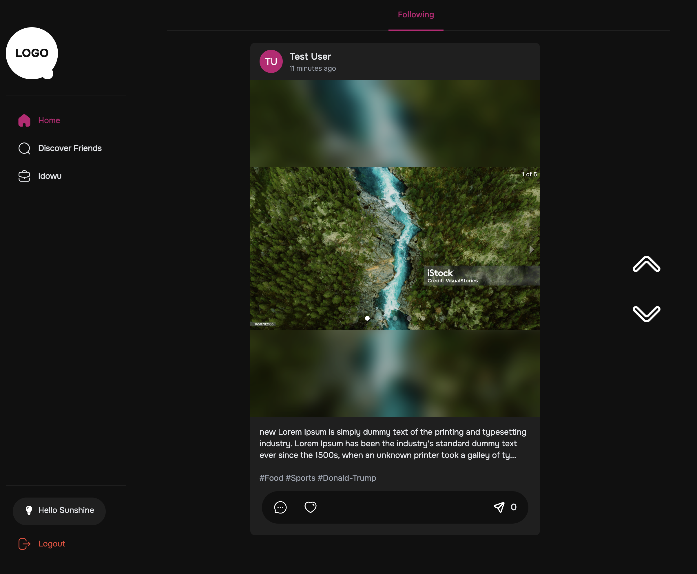
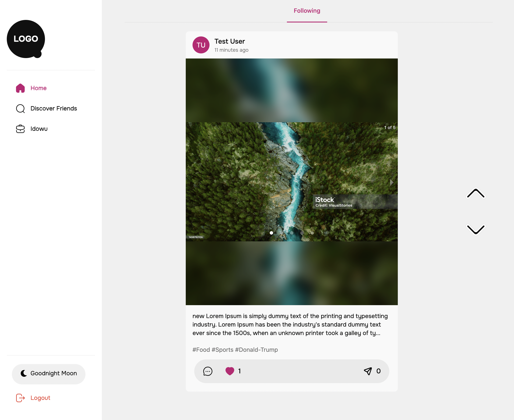
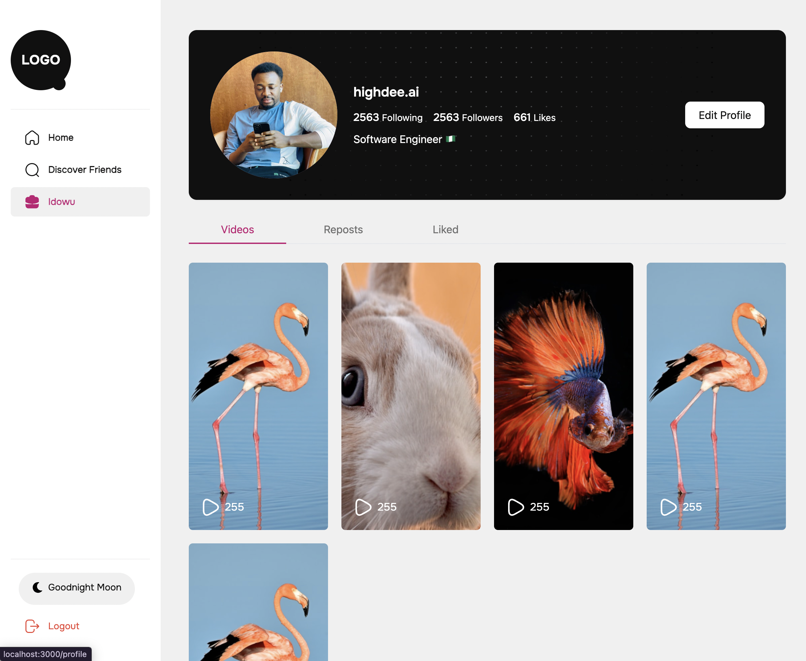
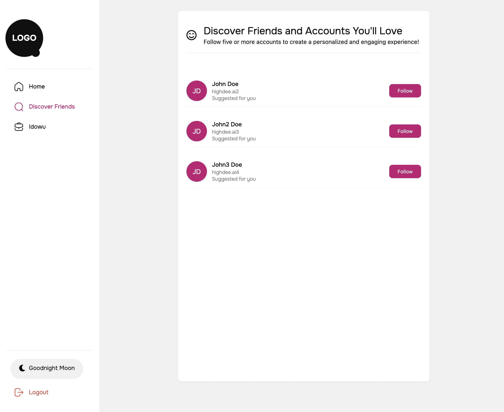
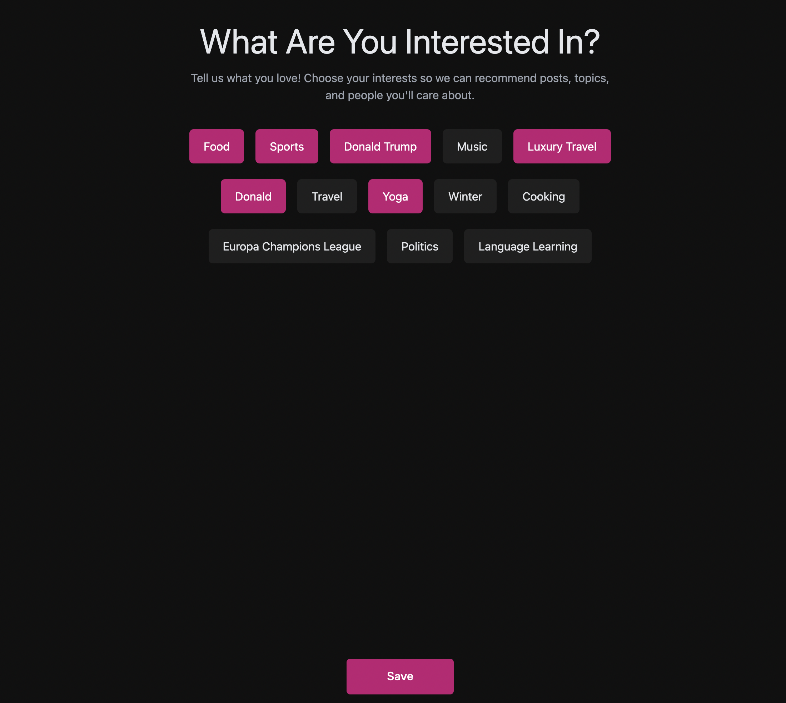

# Frontend Documentation for Folk Social App

## Overview
This repository contains the frontend code for the **Folk Social App**, a social networking platform built using **React** and **TypeScript**. The application enables users to connect, share posts, and interact with other users. The frontend communicates with the backend via RESTful APIs and implements a responsive design for seamless usability across devices.

---

## Screenshots





---

## Features
- **Authentication**:
  - User login and registration functionality.
  - JWT-based authentication.
  - Automatic token refresh and logout on token expiration.
- **User Profiles**:
  - View and edit user profile information.
  - Follow and unfollow other users.
- **Posts and Comments**:
  - Create, view, and interact with posts.
  - Add comments to posts and reply to comments.
- **Theme Toggle**:
  - Switch between light and dark modes.
  - Preferences saved for future sessions.
- **Pagination**:
  - Paginated views for posts and comments.
  - Optimized for performance.
- **Global State Management**:
  - State management using Redux Toolkit.
  - Centralized handling of API calls and state updates.

---

## Tech Stack

- **Frontend Framework**: React (with TypeScript)
- **State Management**: Redux Toolkit
- **Routing**: React Router DOM
- **Styling**: Tailwind CSS
- **API Calls**: Axios
- **Build Tool**: Vite

---

## Installation

### Prerequisites
- Node.js (v14 or higher)
- npm or yarn

### Steps
1. Clone the repository:
   ```bash
   git clone https://github.com/highdee11/folk-social-frontend
   cd folk-social-frontend
   ```

2. Clone the backend repository:
   ```bash
   git clone https://github.com/highdee11/folk-social-api
   ```
   Follow the backend setup instructions in its README to start the backend API.

3. Install dependencies:
   ```bash
   npm install
   # or
   yarn install
   ```

4. Configure environment variables:
   Create a `.env` file in the root directory and add the following:
   ```env
   VITE_API_BASE_URL=http://localhost:8080/api
   ```

5. Start the development server:
   ```bash
   npm run dev
   # or
   yarn dev
   ```

6. Open the app in your browser at `http://localhost:3000`.

---
 

## Available Scripts

### Development
```bash
npm run dev
```
Starts the development server.

### Build
```bash
npm run build
```
Builds the app for production.

### Lint
```bash
npm run lint
```
Checks the codebase for linting errors.

---

## Contributing
1. Fork the repository.
2. Create a new branch for your feature or bugfix:
   ```bash
   git checkout -b feature-name
   ```
3. Commit your changes:
   ```bash
   git commit -m "Add new feature"
   ```
4. Push to your branch:
   ```bash
   git push origin feature-name
   ```
5. Open a pull request on GitHub.

---

## Acknowledgements
- React documentation: [reactjs.org](https://reactjs.org/)
- Redux Toolkit documentation: [redux-toolkit.js.org](https://redux-toolkit.js.org/)
- Tailwind CSS documentation: [tailwindcss.com](https://tailwindcss.com/)

